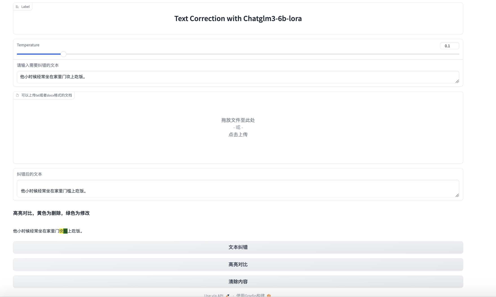
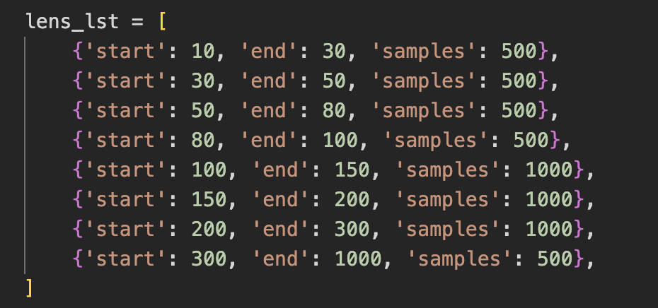
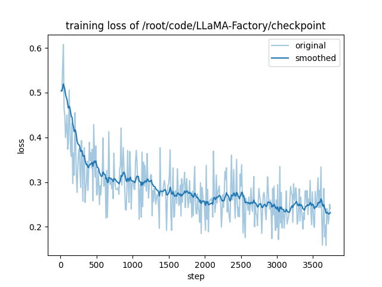
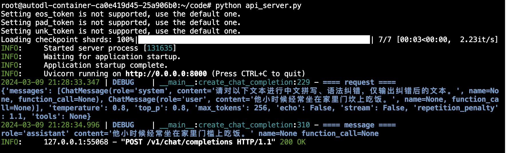
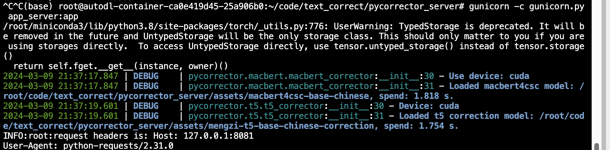
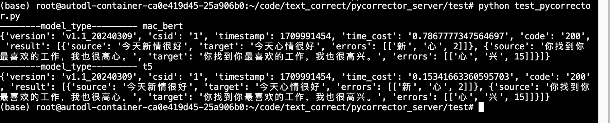
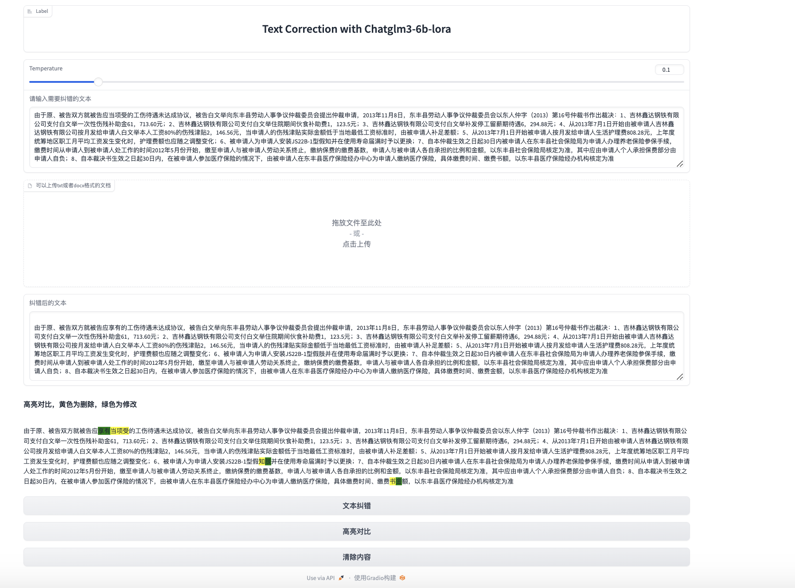

# 基于pycorrector+chatglm3-6b-lora微调的文本纠错应用
## 简介
- 基于chatglm3-6b，使用LLaMA-Factory进行lora微调
- 基于微调后模型，使用fastapi部署openai格式的大模型服务
- 基于flask，部署pycorrector服务
- 基于gradio，部署整体文本纠错应用
- demo展示

## 微调数据准备
- 数据来源：NLPCC 2023 
  - [Task 1: Chinese Grammatical Error Correction](http://tcci.ccf.org.cn/conference/2023/dldoc/nacgec_training.zip)
    - 使用了其中`CTC-2021`的`train_large_v2.json`数据
    - 该数据集共有217634条数据，根据文本长度分布，随机选取4498条数据
    - 基于文本长度选取数据分布
    - 
  - [Task 8: Chinese Spelling Check](https://github.com/Arvid-pku/NLPCC2023_Shared_Task8/blob/main/data/)
    - 该数据集共有1000条数据，去除无需进行纠错的数据后，剩余500条数据
- 微调数据构建
  - 微调数据形式如下
  ```
  {
    "instrution":"请对以下文本进行中文拼写、语法纠错，仅输出纠错后的文本。",
    "input":"他小时候经常坐在家里门坎上吃饭。",
    "output":"他小时候经常坐在家里门槛上吃饭。"
    }
  ```
  - 构造代码见`dataset/get_data.ipynb`，微调数据集见`text_correct.json`
## 基于LLaMA-Factory进行lora微调
- 环境搭建
```
git clone https://github.com/hiyouga/LLaMA-Factory.git
conda create -n llama_factory python=3.10
conda activate llama_factory
cd LLaMA-Factory
pip install -r requirements.txt
pip install modelscope
```
- 将微调数据集传入`llama_factory/data`目录下，并在`llama_factory/dataset_info.json`新增
```
"text_correct": {
    "file_name": "text_correct.json",
    "file_sha1": ""
  }
```
- 基于modelscope下载chatglm3-6b模型权重，代码见`download_model.py`
- lora微调脚本
```
CUDA_VISIBLE_DEVICES=0 python src/train_bash.py \
    --stage sft \
    --do_train \
    --model_name_or_path /root/autodl-tmp/ZhipuAI/chatglm3-6b \ # chatglm3-6b模型权重目录
    --dataset text_correct \ # 微调数据集
    --template chatglm3 \ # 模板
    --finetuning_type lora \ # lora微调
    --lora_target query_key_value \ # lora模块
    --output_dir llama_factory/checkpoint \ # 输出目录
    --overwrite_cache \
    --per_device_train_batch_size 1 \ # batch_size
    --gradient_accumulation_steps 4 \ # 梯度累积
    --lr_scheduler_type cosine \ 
    --logging_steps 10 \
    --save_steps 100 \
    --learning_rate 5e-5 \ # 学习率
    --num_train_epochs 3.0 \ # epoch
    --lora_rank 8 \ # lora秩
    --lora_dropout 0.1 \ # lora dropout rate
    --plot_loss \
    --fp16
```
- lora微调时的loss曲线呈下降趋势

- 合并 LoRA 权重并导出模型
```
CUDA_VISIBLE_DEVICES=0 python src/export_model.py \
    --model_name_or_path /root/autodl-tmp/ZhipuAI/chatglm3-6b \ 
    --adapter_name_or_path checkpoint \
    --template chatglm3 \
    --finetuning_type lora \
    --export_dir /root/autodl-tmp/ZhipuAI/chatglm3-6b-lora \
    --export_size 2 \
    --export_legacy_format False
```
## 使用fastapi部署openai格式的大模型服务
### 方案1：借鉴chatglm3官方示例：https://github.com/THUDM/ChatGLM3/blob/main/openai_api_demo/api_server.py
- 环境搭建
```
cd openai_api_demo
sh install.sh
```
- 启动大模型服务
```
cd openai_api_demo
sh start.sh
```
- 服务测试
```
cd openai_api_demo
python openai_api_request.py
```

### 方案2：基于LLaMA-Factory部署openai格式的大模型服务
- 可对`src/llmtuner/api/app.py`进行web服务相关配置参数修改
```
cd LLaMA-Factory
python -m src.llmtuner.api.app --model_name_or_path /root/autodl-tmp/ZhipuAI/chatglm3-6b-lora --template chatglm3 
```
## 基于flask部署pycorrector纠错服务
- 实现基于`macbert4csc-base-chinese`，以及`mengzi-t5-base-chinese-correction`两种模型的文本纠错，需要将模型权重下载到assets目录中
- 环境搭建
```
cd pycorrector_server
sh install.sh
```
- 启动pycorrector服务
```
cd pycorrector_server
sh start.sh
```
- 服务测试
```
cd pycorrector_server/test
python test_pycorrector.py
```


## 基于gradio，部署整体文本纠错应用
### 服务部署
```
cd gradio_demo
python gradio_demo.py
```
web终端打开`http://0.0.0.0:6006/`，即可访问
### 应用逻辑
- 基于gradio实现了用户通过文本框输入，或者通过上传`txt`/`docx`文件上传
- 对上传的`docx`文件，基于langchain进行文本内容读取
- 对于用户输入的待纠错文本进行标准化后，首先调用pycorrector服务，进行第一次纠错
- 对于pycorrector返回的纠错信息，将其与用户输入封装成prompt
- 由于对chatglm3-6b微调的文本长度在1000以下，为了保证大模型纠错效果，在对封装后的prompt进行tokenizer后，如果token长度小于1024，则直接送入大模型进行二次纠错；如果token长度大于1024，则需要对待纠错文本按照`。！？\n`进行分句，分句长度在100左右，然后将分句逐一传给大模型进行二次纠错
- 将大模型纠错后的文本回传到web页面output文本框内，并与用户输入的原始文本使用`difflib`进行比对，生成高亮对比markdown文本，在web页面中渲染
### 纠错示范
- 纠错素材
```
由于原、被告双方就被告应当项受的工伤待遇未达成协议，被告白文举向东丰县劳动人事争议仲裁委员会提出仲裁申请，2013年11月8日，东丰县劳动人事争议仲裁委员会以东人仲字（2013）第16号仲裁书作出裁决：1、吉林鑫达钢铁有限公司支付白文举一次性伤残补助金61，713.60元；2、吉林鑫达钢铁有限公司支付白文举住院期间伙食补助费1，123.5元；3、吉林鑫达钢铁有限公司支付白文举补发停工留薪期待遇6，294.88元；4、从2013年7月1日开始由被申请人吉林鑫达钢铁有限公司按月发给申请人白文举本人工资80%的伤残津贴2，146.56元，当申请人的伤残津贴实际金额低于当地最低工资标准时，由被申请人补足差额；5、从2013年7月1日开始被申请人按月发给申请人生活护理费808.28元，上年度统筹地区职工月平均工资发生变化时，护理费额也应随之调整变化；6、被申请人为申请人安装JS22B-1型假知并在使用寿命届满时予以更换；7、自本仲裁生效之日起30日内被申请人在东丰县社会保险局为申请人办理养老保险参保手续，缴费时间从申请人到被申请人处工作的时间2012年5月份开始，缴至申请人与被申请人劳动关系终止，缴纳保费的缴费基数，申请人与被申请人各自承担的比例和金额，以东丰县社会保险局核定为准，其中应由申请人个人承担保费部分由申请人自负；8、自本裁决书生效之日起30日内，在被申请人参加医疗保险的情况下，由被申请人在东丰县医疗保险经办中心为申请人缴纳医疗保险，具体缴费时间、缴费书额，以东丰县医疗保险经办机构核定为准
```
- 纠错结果
